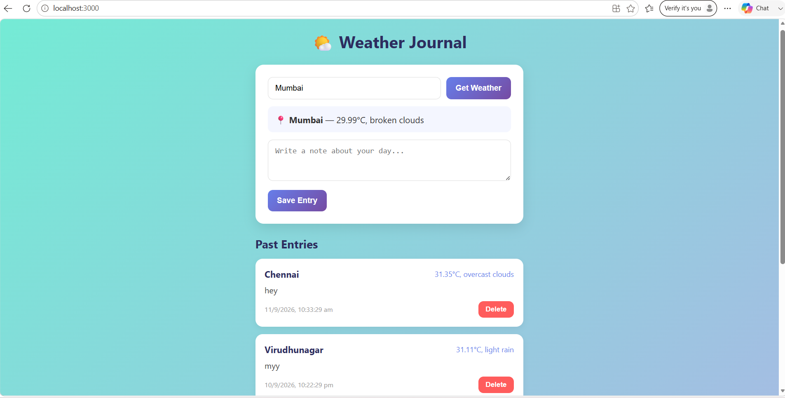

# 🌤️ Weather Journal App

A full stack web app that lets you check live weather for any city and save it alongside a personal note — building a simple journal of your days and the weather that came with them.

## Live Demo
🔗 [Coming soon]

## Features
- Search live weather for any city worldwide
- Save daily journal entries with weather data attached
- View a history of all past entries
- Delete entries you no longer want
- Fully responsive design (works on mobile too)

## Tech Stack
**Frontend:** React, CSS3
**Backend:** Node.js, Express
**Database:** MongoDB (Mongoose)
**External API:** OpenWeatherMap API
**Version Control:** Git & GitHub

## How It Works
1. User enters a city name and clicks "Get Weather"
2. App fetches live weather data from the OpenWeatherMap API
3. User writes a note and saves the entry
4. Entry (city, temperature, condition, note, date) is stored in MongoDB via an Express backend
5. All saved entries are displayed in a scrollable list, with the option to delete any entry

## Screenshots

## Running Locally

### Prerequisites
- Node.js installed
- A free MongoDB Atlas account
- A free OpenWeatherMap API key

### Setup
1. Clone the repo
